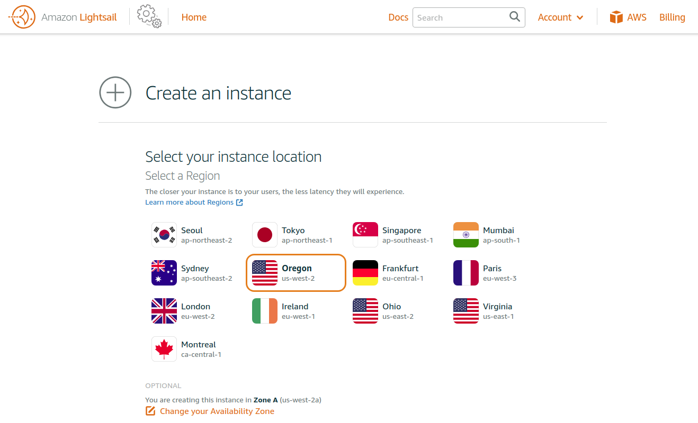
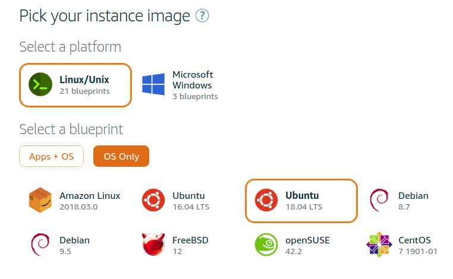
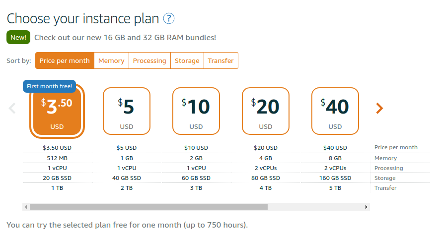
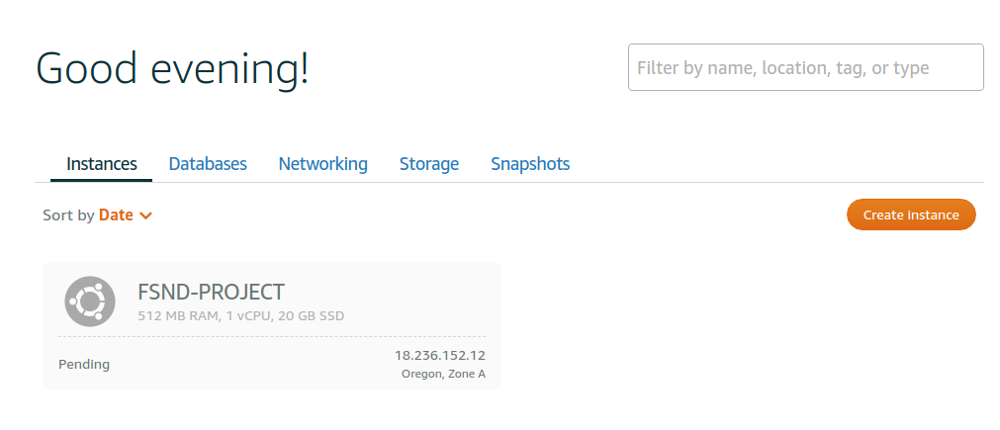
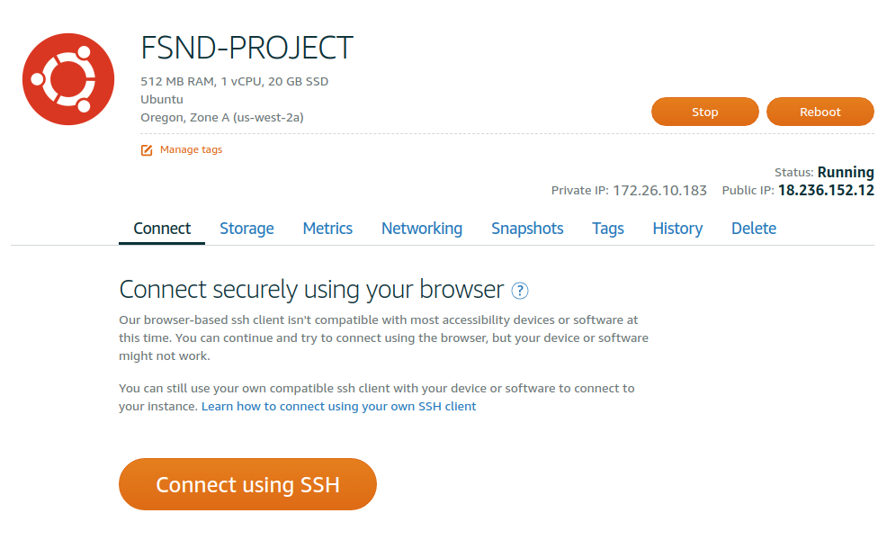
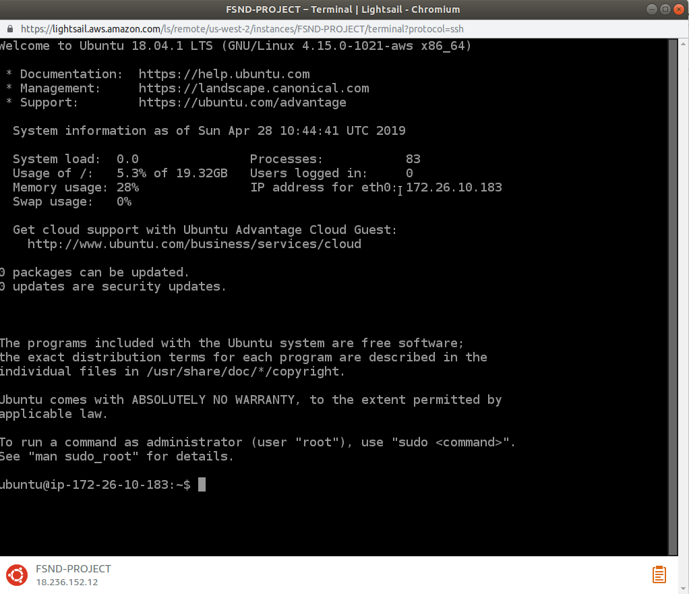
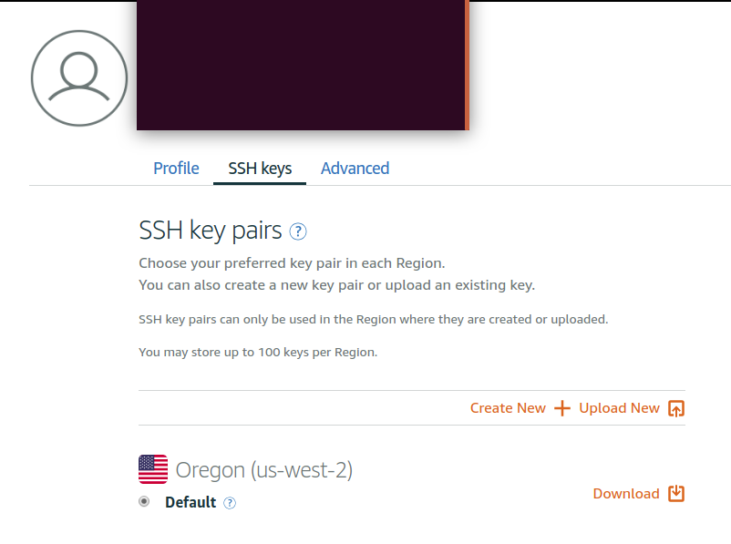

# linux-server-configuration


## Get your server (Amazon LightSail)
  1. Log in!
  2. Create an instance and choose you region
  
  3. Choose an instance image: Ubuntu
  
  4. Choose your instance plan.
  
  5. Give your instance a hostname. (In our case, FSND-PROJECT)
  6. Wait for it to start up. It's running let's use it! 
  
  7. Click the 'connecting the ssh' button to login to instance that we've just created.
  
  
  8. Project time.


## Configuration Setup


1. Go to account page from your AWS account.
  
2. Download your SSH key (ex. LightsailDefaultPrivateKey-2.pem)
3. Navigate to the directory where your file is stored in your terminal.
4. Move the private key file into the folder ~/.ssh
  ```bash
  $ mv /(current_private_key_address)/udacity_key.rsa ~/.ssh/
  ```
5. Change the key permission so that only owner can read and write

```
$ chmod 600 ~/.ssh/udacity_key.rsa
```
6. Let's log into out instance with SSH

```bash
$ ssh -i ~/.ssh/lightsail_key.rsa ubuntu@18.236.152.12
```

## Secure your server.

1. Change the SSH port from 22 to 2200. 
2. Edit /etc/ssh/sshd_config file by sudo nano /etc/ssh/sshd_config
```bash
$ nano /etc/ssh/sshd_config
```
3. Change port from 22 to 2200
4. Restart SSH 
```bash
$ sudo service ssh restart
```
5. Configure the Uncomplicated Firewall (UFW) to only allow incoming connections for SSH (port 2200), HTTP (port 80), and NTP (port 123).

```bash 
$ sudo ufw status -- utf should be inactive
$ sudo ufw default deny incoming -- deny all incoming requests
$ sudo ufw default allow outgoing-- allow all outgoing requests
$ sudo ufw allow ssh
$ sudo ufw allow 2200/tcp -- allow incoming ssh request
$ sudo ufw allow 80/tcp -- allow all http request
$ sudo ufw allow 123/udp -- allow ntp request
$ sudo ufw deny 22 -- deny incoming request for port 22
$ sudo ufw enable -- enable ufw
$ sudo ufw status -- check current status of ufw
```

## Give ```grader``` access
1. create ```grader``` user
```bash
$ sudo adduser grader
```

2. Create a new directory in sudoer directory 
```bash
sudo nano /etc/sudoers.d/grader
```

and add the following.
```
grader ALL=(ALL:ALL) ALL 
```

3. Now let's comeback to our local terminal (not Lightsail)
4. Generate ssh-keygen in your local machine for 'grader' user

```bash
$ ssh-keygen
```
5. Copy the generated SSH to a virtual environment (Lightsail).

6. Then on you VM terminal, create the .ssh directory and create authorized_keys file.

```bash
$ su - grader
$ mkdir .ssh
$ touch .ssh/authorized_keys
```

7. Copy your SSH key we've created on step 5.
```bash
$ nano .ssh/authorized_keys 
```
8. Reload SSH
```bash
$ sudo service ssh restart
```

9. Test if ou can login grader user.

10. If succeeded, disable rootlogin.
```bash
$ nano /etc/ssh/sshd_config
```
11. Find 'PermitRootLogin' and change it to no.

## Update all packages
```bash 
$ sudo apt-get update 
$ sudo apt-get upgrade
```

1. Set up local time zone
```bash
$ sudo dpkg-reconfigure tzdata 
```
2. And choose UTC

## Prepare to deploy your project

### install Apache engine

1. Install apache software as grader.
```bash
$ sudo apt-get install apache2
```

Enter public IP of the Amazon EC2 instance into browser to check whether Apache installed or not. If success, it displays the APACHE PAGE. 

2. Install several library functions of apache using the command
```bash
$ sudo apt-get install libapache2-mod-wsgi-py3
$ sudo a2enmod wsgi
$ sudo apt-get install libpq-dev python-dev
```

### Install git and clone project

1. 
```bash
$ sudo apt-get install git
```

2. Configure your username and email. 
```bash
$ git config --global user.name <username> 
$ git config --global user.email <email>
```

3. From /var/www/, make new directory and change the owner to grader
```bash
$ mkdir catalog
$ sudo chown -R grader:grader catalog
```

4. From /var/www/, make new directory and change the owner to grader
```bash
$ mkdir catalog
$ sudo chown -R grader:grader catalog
```

5. Clone you project on /var/www/catalog .
```bash
cd /var/www/catalog
$ git clone git@github.com:DeepLearnerSC/item-catalog.git
```

6. Create .wsgi file
```bash
$ touch catalog.wsgi
$ nano catalog.wsgi
```

the content is the following
```bash
import sys
import logging
logging.basicConfig(stream=sys.stderr)
sys.path.insert(0, "/var/www/catalog/")

from catalog import app as application
application.secret_key = 'superUltraSecret'
``` 

### installing the virtual environment for python

1. From /var/www/catalog/catalog directory install pip:
```bash
$ sudo apt-get install python3-pip
```
2. Install the virtual environment:
```
$ sudo apt-get install python-virtualenv
```
3. Create the virtual environment:
```
$ sudo virtualenv -p python3 venv3.
```
4. Change the ownership to grader with:
```
$ sudo chown -R grader:grader venv3.
```

### install all the dependency